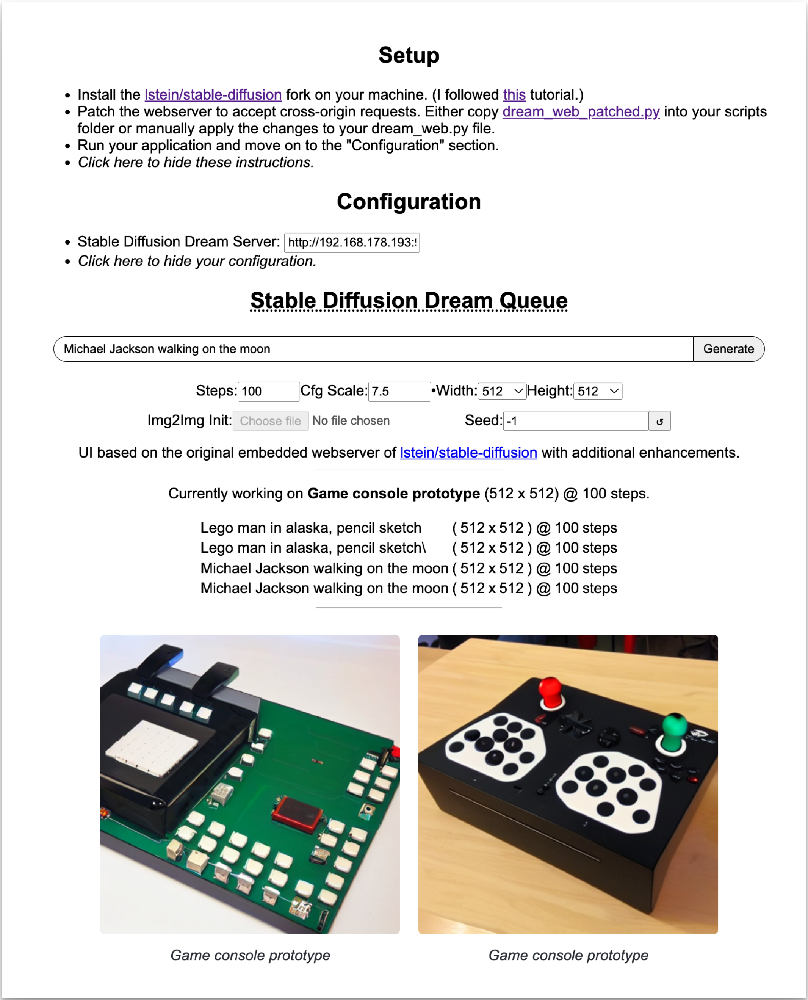

# Extended web interface and prompt queue for Stable Diffusion


An alternative frontend for [lstein/stable-diffusion](https://github.com/lstein/stable-diffusion).

## Features:

- **Prompt queue**: Submit multiple prompts to Stable Diffusion, and have them executed in succession.
- **Automatic prompt repetition**: When your queue is empty, your last prompt is automatically repeated to make sure you
  always keep dreaming.



## Usage

As a user, simply visit the hosted instance, and follow the setup instructions to make sure it works with your local
installation of stable-diffusion.

## Contributing

Pull requests or any kind of contributions are **very** welcome!

This project is based on the original embedded web interface
in [lstein/stable-diffusion](https://github.com/lstein/stable-diffusion/) ([MIT](https://github.com/lstein/stable-diffusion/blob/main/LICENSE)), rewritten into
SolidJS.

I am a SolidJS beginner, and made this during some late nights, so the code is _far_ from perfect. For example:

- [ ] The CSS could do with an overhaul
- [ ] The queue display is not based on reactivity, but just updates on a timer.

There's also some features that are currently not working:

- [ ] img2img
- [ ] (probably more that I'm not aware of)

If you'd like to contribute to any of these, then I'd be more than happy to receive your pull request! 🤗

### Setting up and running the project

This is a SolidJS TypeScript project. General instructions for SolidJS projects apply:

```bash
$ npm install # or pnpm install or yarn install
```

### Learn more on the [Solid Website](https://solidjs.com) and come chat with us on our [Discord](https://discord.com/invite/solidjs)

### Available Scripts

In the project directory, you can run:

#### `npm dev` or `npm start`

Runs the app in the development mode.<br>
Open [http://localhost:3000](http://localhost:3000) to view it in the browser.

The page will reload if you make edits.<br>

#### `npm run build`

Builds the app for production to the `dist` folder.<br>
It correctly bundles Solid in production mode and optimizes the build for the best performance.

The build is minified and the filenames include the hashes.<br>
Your app is ready to be deployed!

#### Deployment

You can deploy the `dist` folder to any static host provider (netlify, surge, now, etc.)
